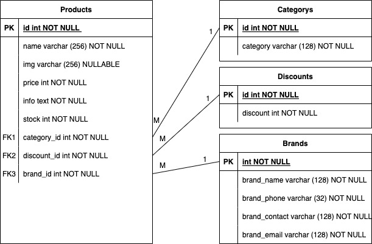

# Webbtjänst för Discgolfbutiken

av Jessica Ejelöv, jessicaejelov@gmail.com
Projektuppgift för kursen Fullstack-utveckling med ramverk på Mittuniversitetet.
Skapad med Laravel.

<p align="center"><a href="https://laravel.com" target="_blank"></a></p>

<p align="center">
<a href="https://travis-ci.org/laravel/framework"></a>
<a href="https://packagist.org/packages/laravel/framework"></a>
<a href="https://packagist.org/packages/laravel/framework"></a>
<a href="https://packagist.org/packages/laravel/framework"></a>
</p>

## Om webbtjänsten

I denna webbtjänst lagras olika Discgolfbutikens produktlager.

Denna webbtjänst är uppbyggd med Laravel och en MYSQL databas.

## Databasen : installation och uppbyggnad

### ER-diagram för databsen

Produkter kan ha EN(1) Kategori(category), Märke(brand) och Rabatt(discount). Medans Kategorier, Märken och Rabatter kan ha FLERA produkter.



## Klasser och metoder

### ProductController

##### Metoder

- Index - Hämtar alla Produkter från databasen samt adderar namnet för category, discount och brand för bättre utskrifter.
- Store (request) - Sparar anrop till databasen efter validering av anropet.
- Show (id) - Letar efter produkt i databasen med specifikt ID.
- Update (id) - Updaterar produkt i databasen med specifikt ID efter validering av anropet.
- Destroy (id) - Raderar produkt i databasen med specifikt ID.
- searchProductName - Tar sökordet och matchar mot produkternas namn.
- getProductsByCategory - Hämtar alla produkter från specifik kategori.
- getProductsByBrand - Hämtar alla produkter från specifikt märke.
- getProductsByDiscount - Hämtar alla produkter från specifik rabatt.
- calculateAmounts - Beräknar totala antalet discar på lager.

---

### Användning

Nedan finns beskrivet hur man nå APIet på olika vis.

| Metod  | Endpoint                     | Beskrivning                                                  |
| ------ | ---------------------------- | ------------------------------------------------------------ |
| POST   | /api/product                 | Lagrar en ny produkt.                                        |
| GET    | /api/product                 | Hämtar alla tillgängliga produkter.                          |
| GET    | /api/product/2               | Hämtar en specifik produkt med angivet ID (siffra).          |
| GET    | /api/product/category/2      | Hämtar alla produkter i en specifik kategori angivet med ID. |
| GET    | /api/product/brand/2         | Hämtar alla produkter från specifikt märke angivet med ID.   |
| GET    | /api/product/discount/2      | Hämtar alla produkter med en specifik rabatt angivet med ID. |
| GET    | /api/calculate               | Hämtar totala antalet discar på lager.                       |
| PUT    | /api/product/2               | Uppdaterar en existerande produkt med angivet ID (siffra).   |
| DELETE | /api/product/2               | Raderar en produkt med angivet ID.                           |
| GET    | /api/search/product/_sökord_ | Söker i produkters namn efter matchning mot sökordet.        |

En produkt returneras/skickas som JSON med följande struktur:

```
{
  "name": "Fuse",
  "price": "179",
  "info": "En stabil midrange",
  "stock": "100",
  "category_id": "3",
  "brand_id": "1",
  "discount_id": "1",
  "img": "H3myyyHppQAC3kCDOVb7.jpg",
}
```

---

### DiscountController

##### Metoder

- Index - Hämtar alla rabatter från databasen.
- Store (request) - Sparar anrop till databasen efter validering av anropet.
- Show (id) - Letar efter rabatt i databasen med specifikt ID.
- Update (id) - Updaterar rabatt i databasen med specifikt ID efter validering av anropet.
- Destroy (id) - Raderar rabatt i databasen med specifikt ID.

---

### Användning

Nedan finns beskrivet hur man nå APIet på olika vis.

| Metod  | Endpoint        | Beskrivning                                               |
| ------ | --------------- | --------------------------------------------------------- |
| POST   | /api/discount   | Lagrar en ny rabatt.                                      |
| GET    | /api/discount   | Hämtar alla tillgängliga rabatter.                        |
| GET    | /api/discount/2 | Hämtar en specifik rabatt med angivet ID (siffra).        |
| PUT    | /api/discount/2 | Uppdaterar en existerande rabatt med angivet ID (siffra). |
| DELETE | /api/discount/2 | Raderar en rabatt med angivet ID.                         |

En rabatt returneras/skickas som JSON med följande struktur:

```
{
  "discount": "50"
}
```

---

### CategoryController

##### Metoder

- Index - Hämtar alla kategorier från databasen.
- Store (request) - Sparar anrop till databasen efter validering av anropet.
- Show (id) - Letar efter kategori i databasen med specifikt ID.
- Update (id) - Updaterar kategori i databasen med specifikt ID efter validering av anropet.
- Destroy (id) - Raderar kategori i databasen med specifikt ID.

---

### Användning

Nedan finns beskrivet hur man nå APIet på olika vis.

| Metod  | Endpoint        | Beskrivning                                                 |
| ------ | --------------- | ----------------------------------------------------------- |
| POST   | /api/category   | Lagrar en ny kategori.                                      |
| GET    | /api/category   | Hämtar alla tillgängliga kategorier.                        |
| GET    | /api/category/2 | Hämtar en specifik kategori med angivet ID (siffra).        |
| PUT    | /api/category/2 | Uppdaterar en existerande kategori med angivet ID (siffra). |
| DELETE | /api/category/2 | Raderar en kategori med angivet ID.                         |

En kategori returneras/skickas som JSON med följande struktur:

```
{
    "category" : "Midrange"
}
```

---

### BrandController

##### Metoder

- Index - Hämtar alla märken från databasen.
- Store (request) - Sparar anrop till databasen efter validering av anropet.
- Show (id) - Letar efter märke i databasen med specifikt ID.
- Update (id) - Updaterar märke i databasen med specifikt ID efter validering av anropet.
- Destroy (id) - Raderar märke i databasen med specifikt ID.

---

### Användning

Nedan finns beskrivet hur man nå APIet på olika vis.

| Metod  | Endpoint     | Beskrivning                                              |
| ------ | ------------ | -------------------------------------------------------- |
| POST   | /api/brand   | Lagrar ett nytt märke.                                   |
| GET    | /api/brand   | Hämtar alla tillgängliga märken.                         |
| GET    | /api/brand/2 | Hämtar en specifik märke med angivet ID (siffra).        |
| PUT    | /api/brand/2 | Uppdaterar en existerande märke med angivet ID (siffra). |
| DELETE | /api/brand/2 | Raderar en märke med angivet ID.                         |

Ett märke returneras/skickas som JSON med följande struktur:

```
{
    "brand_name": "Latitude 64",
    "brand_phone": "0701234567",
    "brand_contact": "Jonathan",
    "brand_email": "jonathan@latitude64.com",
}
```

---

### AuthController

##### Metoder

- Register - registrera en användare med namn, email och lösenord.
- Login - kontrollera att inloggningsuppgifter finns i databasen och skicak med token som svar.
- Logout - logga ut användare genom att förstöra token.

---

### Användning

Nedan finns beskrivet hur man nå APIet på olika vis.

| Metod  | Endpoint      | Beskrivning                       |
| ------ | ------------- | --------------------------------- |
| POST   | /api/logout   | Loggar ut användare.              |
| POST   | /api/login    | Loggar in användare.              |
| POST   | /api/register | Registrera ny användare           |
| GET    | /api/users    | Hämta alla användare              |
| DELETE | /api/users/2  | Radera användare med specifikt id |

Ett inlogg returneras/skickas som JSON med följande struktur:

```
{
    "email": "user@mail.com",
    "password": "password",

}
```

Registrerar ny användare returneras/skickas som JSON med följande struktur:

```
{
    "name" : "Name",
    "email": "user@mail.com",
    "password": "password",

}
```

---
